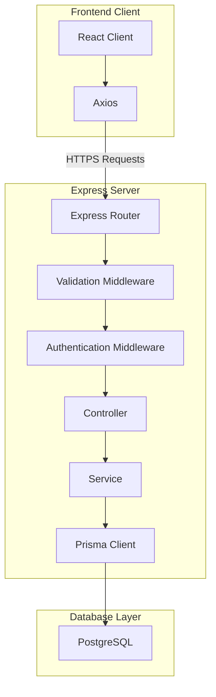
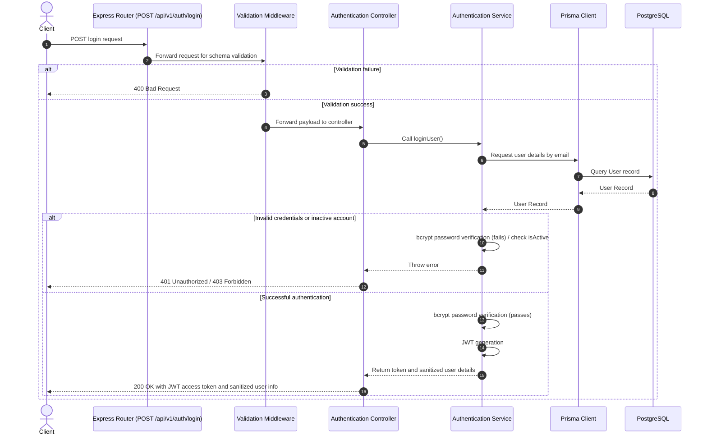
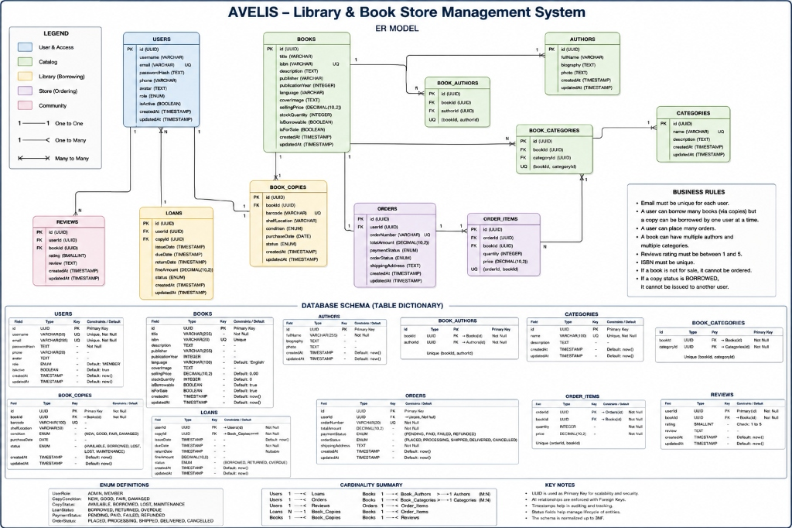

# AVELIS

A premium, full-stack Library Management System with a modern, fluid user experience and a scalable, layered backend architecture.

---

[](#)
[](#)
[](#)
[](#)
[](#)
[](#)
[](#)

---

## Table of Contents

- [Project Overview](#project-overview)
- [Motivation / Purpose](#motivation--purpose)
- [Project Status](#project-status)
- [Latest Milestone](#latest-milestone)
- [Project Statistics](#project-statistics)
- [Implemented Features](#implemented-features)
- [Authentication Features](#authentication-features)
- [Authentication Technology Stack](#authentication-technology-stack)
- [Tech Stack](#tech-stack)
- [Project Architecture](#project-architecture)
- [Database Design](#database-design)
- [Folder Structure](#folder-structure)
- [Getting Started](#getting-started)
- [Environment Variables](#environment-variables)
- [API Overview](#api-overview)
- [Current Development Progress](#current-development-progress)
- [Future Enhancements](#future-enhancements)
- [Roadmap](#roadmap)
- [Deployment Status](#deployment-status)
- [Screenshots](#screenshots)
- [Contributing](#contributing)
- [License](#license)
- [Author](#author)

---

## Project Overview

AVELIS is a production-quality, premium Library Management System designed to serve as an advanced full-stack portfolio showcase. It demonstrates how a highly interactive, animation-rich frontend interface can be seamlessly integrated with an enterprise-grade backend architecture. 

The application provides readers with a modern, high-fidelity experience for browsing curated collections, cataloging their personal library, logging reading history, and analyzing stats through a polished administration dashboard.

### Project Snapshot

| Category | Status |
| :--- | :--- |
| Frontend Landing Experience | ✅ Complete |
| Backend Authentication | ✅ Complete |
| Database | ✅ Complete |
| User Management | ✅ Complete |
| Books Module | 🚧 In Progress |
| Deployment | ⏳ Planned |

## Motivation / Purpose

Traditional library management systems often suffer from outdated user interfaces, rigid flows, and tightly coupled monolithic backends. AVELIS was built to solve this problem by showing that utility software can feel both premium and exceptionally responsive. 

The primary goals of this project are:
- **Design Excellence**: To demonstrate fluid visual design utilizing dark-themed palettes, custom layouts, and micro-interactions.
- **Architectural Separation**: To implement clean, decoupled design patterns—separating client-side interface controllers from backend transaction management.
- **Maintainability**: To establish a solid codebase foundations using structured layered routing, validation middlewares, and clean relational schemas.

## Project Status

AVELIS is in active development. The backend authentication, user management, profiles, and administration layers are complete.

### Completed
* **Express Backend** – Layered backend architecture with routing, controllers, services, and middleware.
* **PostgreSQL Database** – Relational database configured with normalized schema, constraints, and indexes.
* **Prisma ORM** – Type-safe database access, schema management, and migration support.
* **JWT Authentication** – Secure stateless authentication using signed JWT access tokens.
* **User Registration** – Input validation, uniqueness checks, password hashing, and account creation.
* **User Login** – Credential verification and JWT token generation.
* **Protected Routes** – Authorization middleware protecting authenticated endpoints.
* **Password Hashing (bcrypt)** – Secure hashing of user passwords before persistence.
* **Authentication Middleware** – Centralized JWT verification and authenticated user attachment.
* **Current Authenticated User Endpoint (`/api/v1/auth/me`)** – Safe retrieval of the currently authenticated user's profile.
* **React frontend** – React 19 single-page application scaffolding.
* **Responsive UI** – Responsive page layouts tailored for desktop, tablet, and mobile displays.
* **Prisma migrations** – Version-controlled SQL migration scripts generated and successfully executed.
* **Prisma Studio verification** – Visual table browsing and record administration confirmed.
* **pgAdmin verification** – Direct structural check of tables, columns, constraints, and custom enum types completed.
* **User Profile & Password Actions** – Profile detail retrieval (`GET /me`), username updates (`PATCH /me`), and secure password updates with current password checks (`PATCH /me/password`).
* **Role-Based Access Control (RBAC)** – Authorization layer (`adminMiddleware`) guarding administrative actions for `ADMIN` role users.
* **Admin User & Status Management** – Administrative endpoints to retrieve paginated/filtered user lists, view user details, update user roles, and activate/deactivate user status.
* **Admin Dashboard Statistics** – Concurrent aggregate counts using Prisma client enums (`GET /admin/dashboard`).

### Current Focus
* 🚧 **Phase 8 – Books Module**

---

## Latest Milestone

AVELIS has successfully completed **Phase 8.6 — Restore Book API**, establishing a secure and transactional endpoint to restore previously soft-deleted books back to the active catalog and verify visibility integration.

The following components were implemented and verified during this milestone:
* **Phase 8.6.1 — Restore Book Service**: Domain service reversing soft deletion inside a transactional block (`prisma.$transaction`), setting `isDeleted = false` and `deletedAt = null`, and validating existence and delete status.
* **Phase 8.6.2 — Restore Book Controller**: Decoupled, thin Express controller routing restore calls to the service layer and wrapping outputs with standardized API JSON responses.
* **Phase 8.6.3 — Restore Book Route**: Router binding mounting `PATCH /api/v1/books/:id/restore` behind authentication (`authMiddleware`), administrator authorization (`adminMiddleware`), and a dedicated UUID parameter validator (`bookIdParamValidator`).
* **Phase 8.6.4 — Restore Book Testing & Documentation**: Conducted E2E integration test runs via custom Express execution stacks, verified public visibility reintegration, and completed API documentation.

> **Next Milestone:** Phase 8.7 — Book Permanent Delete API

## Project Statistics

| Property | Value |
| :--- | :--- |
| **Frontend** | React 19, Vite, Tailwind CSS v4, Framer Motion |
| **Backend** | Node.js, Express.js |
| **Database** | PostgreSQL |
| **ORM** | Prisma ORM |
| **Architecture** | Layered (Controllers, Services, Models, Routes) |
| **Database Tables** | 11 Application Tables |
| **Deployment Status** | Deploys Pending API Completion |
| **License** | ISC License |

---

## Implemented Features

### Frontend (Completed)
- **Premium Landing Page**: An immersive entry page highlighting the application's vision with smooth typography.
- **Responsive Navigation**: Clean, adaptive menu layouts tailored for mobile, tablet, and desktop viewports.
- **Hero Section**: A high-impact hero header using modern design styles to introduce the platform.
- **Collections Page**: A curated, interactive layout for discovering various book lists and genres.
- **Library Page**: A dedicated personal library management screen for indexing owned literature.
- **Reading Journal Page**: A beautiful user log designed to review, rate, and record personal reading notes.
- **Dashboard UI**: A comprehensive statistic dashboard visualizing mock user activity metrics.
- **Framer Motion Integration**: Modern micro-interactions, page transitions, and elegant hover animations.
- **Reusable Component Architecture**: Highly modular, isolated React component architecture utilizing the custom AVELIS design system.

### Backend (Implemented So Far)
- **Express Backend Core**: Node.js/Express.js application initialized and integrated with compression, security configurations (Helmet), HTTP logging (Morgan), and CORS middleware.
- **Layered Software Directory**: Organized architecture dividing files into routes, controllers, services, middlewares, and models.
- **Prisma ORM Setup**: Prisma Client configured alongside active database schema declarations.
- **PostgreSQL Configuration**: Outlined datasource details ready for relational database mapping.

---

## Authentication Features

The following backend authentication features are fully implemented and integrated:
* Secure user registration
* Secure user login
* JWT-based authentication
* Protected API routes
* Authentication middleware
* Current authenticated user retrieval
* Centralized authentication error handling
* Production-ready layered backend architecture

### Security Highlights

Key security practices implemented to protect user credentials and sessions:
* **Password Hashing (bcrypt)** – User credentials are securely hashed before storage using bcrypt with a salt factor of 10.
* **JWT Authentication** – Stateless authentication using signed JWT access tokens containing only essential user information (ID, email, role).
* **Protected Route Middleware** – Restricts access to authenticated endpoints.
* **Authentication Middleware** – Centralized JWT verification and authenticated request context.
* **Secure Password Verification** – Password comparison performed using bcrypt's secure verification mechanism without exposing plaintext credentials.
* **Environment Secret Isolation** – Cryptographic secrets loaded from environment variables (`JWT_SECRET`).
* **Centralized Authentication Error Handling** – Unified handling of authentication and authorization failures.

### Authentication Technology Stack

| Layer | Technology |
| :--- | :--- |
| Runtime | Node.js |
| Backend Framework | Express.js |
| Authentication | JWT |
| Password Hashing | bcrypt |
| ORM | Prisma |
| Database | PostgreSQL |

## Tech Stack

### Frontend
- **React 19.2.7** — Declarative UI building
- **Vite 8.1.0** — Ultra-fast build tool and bundler
- **JavaScript (ESM)** — Client logic
- **Tailwind CSS v4** — Modern utility-first CSS styling
- **Framer Motion** — Liquid-smooth user interface animations
- **React Router 7.18.0** — Single Page Application routing

### Backend
- **Node.js** — JavaScript runtime environment
- **Express.js 4.21.0** — Lightweight HTTP framework
- **Prisma ORM 6.19.3** — Next-generation database ORM
- **PostgreSQL** — Relational database engine

### Development Tools
- **Git & GitHub** — Version control and hosting
- **VS Code** — Primary code editor
- **Oxlint** — Ultra-fast JavaScript and JSX code linter

---

## Project Architecture

The block diagram below demonstrates the clean flow of data through AVELIS, separating client interactions from database persistence layer:



### Authentication Sequence Diagram

The sequence diagram below illustrates the request/response lifecycle for the user login authentication flow:



---

## Database Design

AVELIS uses PostgreSQL as its primary relational database engine. All database access, schema definition, and table generation are managed via Prisma ORM. The database schema follows Third Normal Form (3NF) design to prevent redundancy, assure data consistency, and enforce strict referential integrity. All models utilize UUIDs as primary keys, and foreign keys enforce referential integrity across related datasets.

The Prisma schema configuration file located at `server/prisma/schema.prisma` is the single source of truth for the database schema.

### Database at a Glance

| Property | Value |
| :--- | :--- |
| **Database Engine** | PostgreSQL |
| **ORM** | Prisma ORM |
| **Normalization** | Third Normal Form (3NF) |
| **Primary Keys** | UUID (v4) |
| **Relationship Types** | One-to-One, One-to-Many, Many-to-Many |
| **Timestamp Strategy** | Automatic `createdAt` and `updatedAt` |
| **Many-to-Many Strategy** | Explicit junction tables (`BookAuthor`, `BookCategory`) |

### Entity Relationship Diagram

[](docs/images/er-diagram.png)

> The following Entity Relationship Diagram illustrates the complete AVELIS database architecture, including entities, relationships, constraints, cardinalities, and business rules.
>
> Click the diagram to view the full-resolution version.

### Database Overview

| Table | Purpose |
| :--- | :--- |
| **User** | Stores user credentials, profiles, contact details, account statuses, and authorization roles. |
| **Book** | Stores abstract catalog metadata for book titles, including pricing, ISBN codes, and sale/borrow settings. |
| **Author** | Stores writer details, biographical descriptions, and references to profile photos. |
| **Category** | Stores genres, classifications, and category descriptions. |
| **BookAuthor** | Explicit junction table resolving the many-to-many relationship between books and authors. |
| **BookCategory** | Explicit junction table resolving the many-to-many relationship between books and categories. |
| **BookCopy** | Stores physical inventory tracking records, barcodes, conditions, and locations for individual copies. |
| **Loan** | Tracks checkout transactions, due dates, return timestamps, and overdue fine amounts. |
| **Order** | Stores customer book purchase order headers, shipping details, and billing totals. |
| **OrderItem** | Stores line-item details of books purchased in a single purchase order. |
| **Review** | Stores customer ratings and written feedback for book catalog entries. |

### Table Dictionary

#### User

| Column | Type | Description |
| :--- | :--- | :--- |
| **id** | UUID | Unique identifier and primary key. |
| **username** | String | Unique display name used for profile access. |
| **email** | String | Unique email address used for login and notifications. |
| **passwordHash** | String | Cryptographic hash of the user password. |
| **phone** | String | Optional contact telephone number. |
| **avatar** | String | Optional URL referencing the user profile picture. |
| **role** | Enum | Authorization level (ADMIN, MEMBER). |
| **isActive** | Boolean | Flag determining if the user account is active. |
| **createdAt** | DateTime | Timestamp when the user account was registered. |
| **updatedAt** | DateTime | Timestamp when the user profile was last updated. |

#### Book

| Column | Type | Description |
| :--- | :--- | :--- |
| **id** | UUID | Unique identifier and primary key. |
| **title** | String | The official title of the cataloged book. |
| **isbn** | String | Unique International Standard Book Number. |
| **publisher** | String | Optional publishing house name. |
| **publicationYear** | Integer | Optional year the book edition was released. |
| **language** | String | Primary language of the text. |
| **description** | String | Optional synopsis or review of the book content. |
| **coverImage** | String | Optional URL referencing the cover artwork. |
| **sellingPrice** | Decimal | Retail purchase price for bookstore sales. |
| **stockQuantity** | Integer | Quantity of copies available for commercial purchase. |
| **isBorrowable** | Boolean | Flag determining if the book copies are rentable. |
| **isForSale** | Boolean | Flag determining if the book is available for purchase. |
| **createdAt** | DateTime | Timestamp when the catalog entry was created. |
| **updatedAt** | DateTime | Timestamp when the catalog entry was last updated. |

#### Author

| Column | Type | Description |
| :--- | :--- | :--- |
| **id** | UUID | Unique identifier and primary key. |
| **fullName** | String | The complete name of the writer. |
| **biography** | String | Optional summary of the author's history. |
| **photo** | String | Optional URL referencing the author's image. |
| **createdAt** | DateTime | Timestamp when the author record was created. |
| **updatedAt** | DateTime | Timestamp when the author record was last updated. |

#### Category

| Column | Type | Description |
| :--- | :--- | :--- |
| **id** | UUID | Unique identifier and primary key. |
| **name** | String | Unique name representing the category or genre. |
| **description** | String | Optional explanation of the genre parameters. |
| **createdAt** | DateTime | Timestamp when the category was created. |
| **updatedAt** | DateTime | Timestamp when the category was last updated. |

#### BookAuthor

| Column | Type | Description |
| :--- | :--- | :--- |
| **id** | UUID | Unique identifier and primary key. |
| **bookId** | UUID | Foreign key referencing the associated Book. |
| **authorId** | UUID | Foreign key referencing the associated Author. |

#### BookCategory

| Column | Type | Description |
| :--- | :--- | :--- |
| **id** | UUID | Unique identifier and primary key. |
| **bookId** | UUID | Foreign key referencing the associated Book. |
| **categoryId** | UUID | Foreign key referencing the associated Category. |

#### BookCopy

| Column | Type | Description |
| :--- | :--- | :--- |
| **id** | UUID | Unique identifier and primary key. |
| **bookId** | UUID | Foreign key referencing the parent Book catalog item. |
| **barcode** | String | Unique serial barcode sticker for scanner tracking. |
| **shelfLocation** | String | Optional warehouse or library shelf location. |
| **condition** | Enum | Quality condition of the physical copy (NEW, GOOD, FAIR, DAMAGED). |
| **status** | Enum | Availability status (AVAILABLE, BORROWED, LOST, MAINTENANCE). |
| **purchaseDate** | Date | Optional date when the physical copy was acquired. |
| **createdAt** | DateTime | Timestamp when the inventory copy was logged. |
| **updatedAt** | DateTime | Timestamp when the inventory copy was last modified. |

#### Loan

| Column | Type | Description |
| :--- | :--- | :--- |
| **id** | UUID | Unique identifier and primary key. |
| **userId** | UUID | Foreign key referencing the borrowing User. |
| **copyId** | UUID | Foreign key referencing the specific physical BookCopy. |
| **issueDate** | DateTime | Date and time when the loan was checked out. |
| **dueDate** | DateTime | Expected return deadline for the book. |
| **returnDate** | DateTime | Optional date and time when the copy was returned. |
| **fineAmount** | Decimal | Overdue penalty fees assessed on the loan transaction. |
| **status** | Enum | Lifecycle status of the loan (BORROWED, RETURNED, OVERDUE). |
| **createdAt** | DateTime | Timestamp when the loan record was initialized. |
| **updatedAt** | DateTime | Timestamp when the loan record was last modified. |

#### Order

| Column | Type | Description |
| :--- | :--- | :--- |
| **id** | UUID | Unique identifier and primary key. |
| **userId** | UUID | Foreign key referencing the customer User. |
| **orderNumber** | String | Unique purchase transaction reference number. |
| **totalAmount** | Decimal | Total financial amount invoiced for the order. |
| **paymentStatus** | Enum | Processing status of the payment (PENDING, PAID, FAILED, REFUNDED). |
| **orderStatus** | Enum | Processing status of order fulfillment (PLACED, PROCESSING, SHIPPED, DELIVERED, CANCELLED). |
| **shippingAddress** | String | Delivery location for dispatch. |
| **orderedAt** | DateTime | Date and time when the order was submitted. |
| **createdAt** | DateTime | Timestamp when the order was created. |
| **updatedAt** | DateTime | Timestamp when the order was last updated. |

#### OrderItem

| Column | Type | Description |
| :--- | :--- | :--- |
| **id** | UUID | Unique identifier and primary key. |
| **orderId** | UUID | Foreign key referencing the parent purchase Order. |
| **bookId** | UUID | Foreign key referencing the retail Book purchased. |
| **quantity** | Integer | Number of units purchased for this book entry. |
| **unitPrice** | Decimal | Price charged per unit at the time of order placement. |

#### Review

| Column | Type | Description |
| :--- | :--- | :--- |
| **id** | UUID | Unique identifier and primary key. |
| **userId** | UUID | Foreign key referencing the author User. |
| **bookId** | UUID | Foreign key referencing the evaluated Book. |
| **rating** | Integer | User rating score (integer value between 1 and 5). |
| **comment** | String | Optional written commentary detailing user feedback. |
| **createdAt** | DateTime | Timestamp when the review was written. |
| **updatedAt** | DateTime | Timestamp when the review was last modified. |

### Database Relationships

Relationships enforce cardinality and database integrity:
- **User ⇄ Loans** (One-to-Many): A user can check out multiple book copies over time.
- **User ⇄ Orders** (One-to-Many): A customer can place multiple purchase orders.
- **User ⇄ Reviews** (One-to-Many): A user can write reviews for multiple books.
- **Book ⇄ Authors** (Many-to-Many): A book can have multiple authors, and an author can write multiple books. This is explicitly resolved through the `BookAuthor` junction table.
- **Book ⇄ Categories** (Many-to-Many): A book can belong to multiple categories, and a category can contain multiple books. This is explicitly resolved through the `BookCategory` junction table.
- **Book ⇄ BookCopies** (One-to-Many): A catalog book can own multiple physical book copies.
- **Book ⇄ Reviews** (One-to-Many): A book catalog entry can have multiple reviews written by different users.
- **Book ⇄ OrderItems** (One-to-Many): A catalog book can be referenced in multiple purchase order line-items.
- **Order ⇄ OrderItems** (One-to-Many): A single order header owns multiple order line-items.
- **BookCopy ⇄ Loans** (One-to-Many): A specific physical copy can have multiple checkout transactions over its lifecycle.

### Business Rules

Database constraints and validations protect data logic:
- **Unique Identifiers**: User email addresses, usernames, ISBN numbers, order numbers, and copy barcodes must be globally unique.
- **Feedback Limitation**: A user can review a specific book only once. This is enforced by a composite unique index on (userId, bookId).
- **Consolidated Orders**: A book can appear only once in a purchase order. Multiple units of the same book are consolidated under the quantity field on the OrderItem using a composite unique index on (orderId, bookId).
- **Physical Copy Lending**: A physical copy can only be borrowed by one user in an active Loan at any given time. Copies marked `BORROWED` or `MAINTENANCE` cannot be checked out for a new loan.
- **Retail Restrictions**: Books not marked with `isForSale` cannot appear in orders.
- **Validation Boundaries**: Ratings must be integers bounded between 1 and 5. Stock quantity and order item quantity must remain non-negative.
- **Auditing Integrity**: Foreign key constraints maintain referential integrity. Custom enumerations restrict values to valid system states.

### Design Principles

The design philosophy follows enterprise relational database principles:
- **Third Normal Form (3NF)**: Normalizes tables to avoid redundant storage and update anomalies.
- **UUID Primary Keys**: Ensures global uniqueness, shields against enumeration attacks, and prepares for distributed database clustering.
- **Junction Tables**: Manages many-to-many relationships explicitly, permitting future column additions.
- **Prisma Migrations**: Tracks all schema upgrades via version-controlled SQL files.
- **Foreign Key Constraints**: Standardizes cascades (`onDelete: Cascade` for dependencies like junction tables and reviews) and restrictions (`onDelete: Restrict` for audit records like loans and orders).
- **Index Optimization**: B-tree database indexes (`@@index`) are placed on all foreign key columns to speed up query JOIN execution paths.
- **Automatic Timestamps**: Automatic track of creation (`createdAt`) and update (`updatedAt`) dates simplifies auditing.
- **Enumerations**: Constrains values to predefined, type-safe states.

### Schema Evolution

The database schema evolves through version-controlled Prisma Migrations. Developers must modify the schema file at `server/prisma/schema.prisma` before generating a new migration using `npx prisma migrate dev`. Editing PostgreSQL tables directly is discouraged except for maintenance operations.

---

## Folder Structure

```text
AVELIS/
├── public/                 # Static asset folders
├── src/                    # Frontend source root
│   ├── assets/             # Media files, global icons
│   ├── components/         # Reusable UI layout elements
│   ├── context/            # Global React states
│   ├── data/               # Static mock catalog data
│   ├── hooks/              # Custom React utility hooks
│   ├── pages/              # Application views (Landing, Dashboard, etc.)
│   ├── routes/             # Client-side router declarations
│   ├── sections/           # Modular view-specific components
│   ├── types/              # JS / Prop definitions
│   ├── utils/              # Helper utilities
│   ├── App.jsx             # Main application component
│   ├── main.jsx            # Application entry render
│   └── index.css           # Global CSS and Tailwind directives
│
├── server/                 # Backend source root
│   ├── prisma/             # Prisma schema migrations configuration
│   └── src/                # Express backend application
│       ├── config/         # System configurations
│       ├── constants/      # App-wide constants
│       ├── controllers/    # API request handlers
│       ├── docs/           # Documentation and Swagger
│       ├── errors/         # Custom class exceptions
│       ├── helpers/        # General backend helpers
│       ├── lib/            # Shared libraries (Prisma instance)
│       ├── middleware/     # Custom Express interceptors
│       ├── models/         # Database models structure
│       ├── modules/        # Modular domain-driven structures
│       ├── routes/         # API path routing mappings
│       ├── services/       # Core business logic processing
│       ├── types/          # Type declarations
│       ├── uploads/        # Static uploads folder
│       ├── utils/          # Generic system utilities
│       ├── validators/     # Request payload validation rules
│       ├── app.js          # Express app wrapper
│       └── server.js       # Express server initialization entry
│
├── package.json            # Frontend dependency and scripts configuration
└── vite.config.js          # Vite build parameters
```

---

## Getting Started

### Prerequisites
Ensure you have the following installed on your machine:
- **Node.js** (v18.0.0 or higher is recommended)
- **PostgreSQL** database engine

### Installation

1. **Clone the repository:**
   ```bash
   git clone https://github.com/Aaditgupta1234/AVELIS.git
   cd AVELIS
   ```

2. **Install Frontend dependencies:**
   Ensure you are in the root directory:
   ```bash
   npm install
   ```

3. **Install Backend dependencies:**
   Navigate into the `server` directory and install its components:
   ```bash
   cd server
   npm install
   ```

### Running Frontend
From the root directory, start the Vite development server:
```bash
npm run dev
```
The client application will typically launch at `http://localhost:5173`.

### Running Backend
1. Initialize your local configuration file inside the `server/` directory:
   ```bash
   cd server
   cp .env.example .env
   ```
2. Open `.env` and fill out your PostgreSQL database string.
3. Start the Express development backend using Nodemon:
   ```bash
   npm run dev
   ```
   The backend API will run on the configured port, defaulting to `http://localhost:5000/api/v1`.

---

## Environment Variables

Inside the `server/` directory, create a `.env` file based on the template below:

```ini
# Database Connection String
DATABASE_URL=

# App Server Port Configuration
PORT=

# Authentication Secrets
JWT_SECRET=
JWT_REFRESH_SECRET=
```

---

## API Overview

AVELIS exposes a JSON RESTful API. All backend endpoints are versioned under `/api/v1` to support future API evolution and maintain backward compatibility.

Below are the primary endpoints and their current status:

| Method | Endpoint | Purpose | Status |
| :--- | :--- | :--- | :--- |
| **POST** | `/api/v1/auth/register` | Register a new user profile. | ✅ Completed |
| **POST** | `/api/v1/auth/login` | Authenticate user credentials and return access tokens. | ✅ Completed |
| **GET** | `/api/v1/auth/me` | Fetch active profile details for the authorized session. | ✅ Completed |
| **POST** | `/api/v1/auth/logout` | Clear token credentials. | 🟡 Scaffolded (Placeholder) |
| **GET** | `/api/v1/users/me` | Retrieve active profile details for the authorized session. | ✅ Completed |
| **PATCH** | `/api/v1/users/me` | Update current user profile username. | ✅ Completed |
| **PATCH** | `/api/v1/users/me/password` | Securely update password. | ✅ Completed |
| **GET** | `/api/v1/books` | Retrieve a catalog listing of all books. | ✅ Completed |
| **GET** | `/api/v1/books/:id` | Retrieve details of a specific book. | ✅ Completed |
| **POST** | `/api/v1/books` | Create a new catalog book entry (Admin only). | ✅ Completed |
| **PATCH** | `/api/v1/books/:id` | Update metadata details of a catalog book (Admin only). | ✅ Completed |
| **DELETE** | `/api/v1/books/:id` | Soft delete a catalog book entry (Admin only). | ✅ Completed |
| **PATCH** | `/api/v1/books/:id/restore` | Restore a soft-deleted catalog book (Admin only). | ✅ Completed |
| **GET** | `/api/v1/loans` | Retrieve borrowing loan histories. | In Progress |
| **POST** | `/api/v1/loans` | Create a new borrowing transaction for a physical copy. | Planned |
| **GET** | `/api/v1/orders` | Fetch user purchase order invoices. | Planned |

### Administrative API Overview

The following administrative endpoints are protected by `authMiddleware` and `adminMiddleware`:

| Method | Endpoint | Description |
| :--- | :--- | :--- |
| **GET** | `/api/v1/admin/dashboard` | Retrieve aggregated dashboard counts. |
| **GET** | `/api/v1/admin/users` | Retrieve all users (paginated, sorted, and filtered). |
| **GET** | `/api/v1/admin/users/:id` | Retrieve details of a specific user. |
| **PATCH** | `/api/v1/admin/users/:id/role` | Update a user's role. |
| **PATCH** | `/api/v1/admin/users/:id/status` | Activate or deactivate a user (with self-deactivation protection). |

### Book Update API Specification

**PATCH** `/api/v1/books/:id`

#### Purpose
Update details of a catalog book entry.

#### Authentication
- Authentication required (JWT Bearer Token in `Authorization` header).
- Administrator role (`ADMIN`) required.

#### Request Parameters
- `id` (UUID, path parameter) - Unique identifier of the book.

#### Request Body
The request body is a JSON object. All fields are optional. Only the fields supplied are updated; omitted fields remain unchanged.

| Field | Type | Description |
| :--- | :--- | :--- |
| `title` | String | Title of the book (non-empty, trimmed). |
| `isbn` | String | Unique ISBN (non-empty, trimmed). |
| `publisher` | String | Publisher name (non-empty, trimmed). |
| `publicationYear` | Integer | Year of publication (optional, can be null). |
| `language` | String | Language of text (non-empty, trimmed, default: 'English'). |
| `description` | String | Synopsis or review of the book (optional, can be null). |
| `coverImage` | String | Valid URL pointing to cover image (optional, can be null). |
| `sellingPrice` | Number | Purchase price (must be >= 0). |
| `stockQuantity` | Integer | Units in stock (must be >= 0). |
| `isBorrowable` | Boolean | Whether the book is rentable. |
| `isForSale` | Boolean | Whether the book is purchasable. |
| `authorIds` | Array[UUID] | Non-empty array of valid Author UUIDs. |
| `categoryIds` | Array[UUID] | Non-empty array of valid Category UUIDs. |

#### Success Response
- **Status Code**: `200 OK`
- **Body**:
```json
{
  "success": true,
  "message": "Book updated successfully.",
  "data": {
    "id": "bdc3ffb9-e3d5-4f06-9b7e-6a0f901abeef",
    "title": "Title Updated Via Integrated Route",
    "isbn": "TEST-ROUTE-ISBN-1783321677593",
    "publisher": "Test Publisher",
    "publicationYear": 2026,
    "language": "English",
    "description": null,
    "coverImage": null,
    "sellingPrice": "19.99",
    "stockQuantity": 10,
    "isBorrowable": true,
    "isForSale": true,
    "createdAt": "2026-07-06T07:07:57.595Z",
    "updatedAt": "2026-07-06T07:07:57.618Z",
    "authors": [
      {
        "author": {
          "id": "21a0b8db-117b-494c-8f68-5ea6a406d03a",
          "fullName": "Route Test Author"
        }
      }
    ],
    "categories": [
      {
        "category": {
          "id": "669a6837-4753-48e5-b5da-179b0d288af2",
          "name": "Route Test Category 1783321677590"
        }
      }
    ]
  },
  "meta": {}
}
```

#### Error Responses
- **400 Bad Request**: Validation failed (e.g. invalid UUID path parameter, negative price/stock, invalid author/category IDs, or duplicate IDs in arrays).
  ```json
  {
    "success": false,
    "message": "Validation failed.",
    "errors": [
      { "field": "sellingPrice", "message": "Selling price must be a non-negative number." }
    ]
  }
  ```
- **401 Unauthorized**: Authentication header missing or token is invalid.
  ```json
  {
    "success": false,
    "message": "Authorization header is missing"
  }
  ```
- **403 Forbidden**: Authenticated user lacks `ADMIN` privileges.
  ```json
  {
    "success": false,
    "message": "Access denied. Administrator privileges required."
  }
  ```
- **404 Not Found**: Book record with given `id` does not exist.
  ```json
  {
    "success": false,
    "message": "Book not found."
  }
  ```
- **409 Conflict**: A different book is already registered with the new `isbn`.
  ```json
  {
    "success": false,
    "message": "ISBN already exists."
  }
  ```

### Book Soft Delete API Specification

**DELETE** `/api/v1/books/:id`

#### Purpose
Soft delete a book catalog entry. Soft-deleted books are hidden from public read queries but preserved in the database for references and statistics.

#### Authentication
- Authentication required (JWT Bearer Token in `Authorization` header).
- Administrator role (`ADMIN`) required.

#### Request Parameters
- `id` (UUID, path parameter) — Unique identifier of the book.

#### Success Response
- **Status Code**: `200 OK`
- **Body**:
```json
{
  "success": true,
  "message": "Book deleted successfully.",
  "data": {
    "id": "246ee81b-fdca-4aa2-b62d-603c4a8fedeb",
    "title": "Route SD Book Title",
    "isbn": "TEST-R-SD-ISBN-1783328839393",
    "publisher": "Test Publisher",
    "publicationYear": 2026,
    "language": "English",
    "description": null,
    "coverImage": null,
    "sellingPrice": "19.99",
    "stockQuantity": 10,
    "isBorrowable": true,
    "isForSale": true,
    "isDeleted": true,
    "deletedAt": "2026-07-06T09:07:19.444Z",
    "createdAt": "2026-07-06T09:07:19.395Z",
    "updatedAt": "2026-07-06T09:07:19.454Z",
    "authors": [
      {
        "author": {
          "id": "10dda513-51a2-4374-a961-76ff1716ce75",
          "fullName": "Route SD Author"
        }
      }
    ],
    "categories": [
      {
        "category": {
          "id": "f0c8fd88-8eb5-493b-b6c8-dbf37d45779c",
          "name": "Route SD Category 1783328839390"
        }
      }
    ]
  },
  "meta": {}
}
```

#### Error Responses
- **400 Bad Request** — Invalid UUID path parameter, or the book has already been soft deleted.
  ```json
  {
    "success": false,
    "message": "Invalid book ID."
  }
  ```
  or
  ```json
  {
    "success": false,
    "message": "Book has already been deleted."
  }
  ```
- **401 Unauthorized** — Authentication header missing or token is invalid.
  ```json
  {
    "success": false,
    "message": "Authorization header is missing"
  }
  ```
- **403 Forbidden** — Authenticated user lacks `ADMIN` privileges.
  ```json
  {
    "success": false,
    "message": "Access denied. Administrator privileges required."
  }
  ```
- **404 Not Found** — The requested book could not be found. (This is returned if the book does not exist or has already been soft deleted, keeping the existence of deleted items confidential).
  ```json
  {
    "success": false,
    "message": "Book not found."
  }
  ```

### Book Restore API Specification

**PATCH** `/api/v1/books/:id/restore`

#### Purpose
Restore a previously soft-deleted book catalog entry.

#### Authentication
- Authentication required (JWT Bearer Token in `Authorization` header).
- Administrator role (`ADMIN`) required.

#### Request Parameters
- `id` (UUID, path parameter) — Unique identifier of the book.

#### Success Response
- **Status Code**: `200 OK`
- **Body**:
```json
{
  "success": true,
  "message": "Book restored successfully.",
  "data": {
    "id": "246ee81b-fdca-4aa2-b62d-603c4a8fedeb",
    "title": "Route SD Book Title",
    "isbn": "TEST-R-SD-ISBN-1783328839393",
    "publisher": "Test Publisher",
    "publicationYear": 2026,
    "language": "English",
    "description": null,
    "coverImage": null,
    "sellingPrice": "19.99",
    "stockQuantity": 10,
    "isBorrowable": true,
    "isForSale": true,
    "isDeleted": false,
    "deletedAt": null,
    "createdAt": "2026-07-06T09:07:19.395Z",
    "updatedAt": "2026-07-06T09:07:19.454Z",
    "authors": [
      {
        "author": {
          "id": "10dda513-51a2-4374-a961-76ff1716ce75",
          "fullName": "Route SD Author"
        }
      }
    ],
    "categories": [
      {
        "category": {
          "id": "f0c8fd88-8eb5-493b-b6c8-dbf37d45779c",
          "name": "Route SD Category 1783328839390"
        }
      }
    ]
  },
  "meta": {}
}
```

#### Error Responses
- **400 Bad Request** — Invalid UUID path parameter, or the book is already active (not soft deleted).
  ```json
  {
    "success": false,
    "message": "Invalid book ID."
  }
  ```
  or
  ```json
  {
    "success": false,
    "message": "Book is not deleted."
  }
  ```
- **401 Unauthorized** — Authentication header missing or token is invalid.
  ```json
  {
    "success": false,
    "message": "Authorization header is missing"
  }
  ```
- **403 Forbidden** — Authenticated user lacks `ADMIN` privileges.
  ```json
  {
    "success": false,
    "message": "Access denied. Administrator privileges required."
  }
  ```
- **404 Not Found** — The requested book could not be found. (This is returned if the book does not exist).
  ```json
  {
    "success": false,
    "message": "Book not found."
  }
  ```

---

## Current Development Progress

### Completed
- Premium layout landing page
- Responsive user navigation headers
- Visual assets hero panel
- Library item browse collection view
- Reading Journal log templates
- Interactive Dashboard metrics UI
- Framer Motion micro-interactions
- Reusable modular components structure
- Express API server initialization
- Prisma configuration and schema mapping
- Relational schema initial migration and client generation
- Secure JWT-based backend authentication system (Phase 6)
- Password hashing using bcrypt and custom request payload validation
- Request interception middleware and current authenticated user retrieval endpoint
- User Profile & Password Actions (Profile retrieval, username updates, and password updates) (Phase 7)
- Admin User & Status Management (Retrieve users list, view user details, update user roles, and activate/deactivate status) (Phase 7)
- Book Management APIs (Create Book, Get All Books, Get Book by ID, and Update Book APIs) (Phase 8)
- Soft Delete Book API (validation, service, controller, route, and public read integrations) (Phase 8.5)
- Restore Book API (validation, service, controller, route, and visibility integrations) (Phase 8.6)

### In Progress
- Inventory Management (Physical copy tracking) (Phase 8)
- Loan Management (CRUD operations for borrowing loans) (Phase 9)

### Planned
- Order invoicing and bookstore purchase pipeline
- Production build configurations and server deployment

---

## Future Enhancements

The following features are planned for future releases to expand the capabilities of AVELIS:
- **QR Code Book Checkout**: Generate unique QR codes for physical book copies to allow mobile checking out.
- **Barcode Scanner Integration**: Integrate camera scanning modules to look up book catalog items automatically via barcodes.
- **Email Notifications**: Automate dispatch of borrow summaries, return deadlines, and overdue fines reminders.
- **Wishlist**: Allow users to bookmark books for future loans or purchases.
- **Personalized Book Recommendations**: Build a genre recommendation engine matching books to user reading history.
- **Reading Analytics Dashboard**: Display reading history statistics, pages read counts, and loan statistics visually.
- **Docker Support**: Containerize application environments to simplify deployments.
- **CI/CD Pipeline (GitHub Actions)**: Automate linting, schema validation, and builds through GitHub Actions.
- **Progressive Web App (PWA)**: Add manifest and service workers for offline accessibility.
- **Dark / Light Theme**: Standardize visual configurations to allow system theme preferences.
- **Multi-language Support**: Support localized translations for English, Spanish, and other languages.

### Upcoming Administrative Enhancements
- **Admin Safety Guard**: Prevent deactivation of the last active administrator account to avoid system lockout.
- **Administrative Audit Logging**: Track all administrative actions, details, and timestamps.
- **Role Change History**: Maintain a ledger of user role transitions and the admin who authorized them.
- **Administrative Activity Logs**: Provide visual log explorer interfaces for administrators to trace system edits.
- **Configurable User Sorting and Filtering**: Allow sorting list results by multiple database fields.
- **Pagination for Large User Datasets**: Further scaling of large user datasets with cursor-based pagination.

---

## Roadmap

### Project Phases

#### Completed
* ✅ Backend Authentication Setup
* ✅ User Registration
* ✅ User Login
* ✅ Protected Routes
* ✅ Phase 7 – User Management & Profiles
* ✅ Phase 8.4 – Book Update API
* ✅ Phase 8.5 – Soft Delete Book API
* ✅ Phase 8.6 – Restore Book API

#### Current Focus
* 🚧 Phase 8 – Inventory Management

#### Planned
* Loan Management
* Orders
* Reviews
* Production Security
* Testing
* Deployment

### Component Roadmap

| Module | Completed Features | In Progress Features | Planned Features |
| :--- | :--- | :--- | :--- |
| **Frontend** | Landing Page, Navigation, Hero Panel, Collections, Library page, Reading Journal logs, Dashboard UI | Connecting Login View inputs to authentication APIs | User profile edit dialogs, interactive catalog searches, custom themes |
| **Backend** | Server structure, Express framework configuration, Prisma configuration, JWT Authentication, Registration & Login APIs, Protected Routes, User Management & Profile APIs, Book Management, Soft Delete, & Restore APIs (Create, Get All, Get by ID, Update, Soft Delete, Restore) | Inventory management | Checkout/checkin transactions, Loan Management |
| **DevOps** | Project scaffolding, Oxlint linter integration, workspace dependencies | Setup environment template | API deployment pipelines, production server environment setups |

---

## Deployment Status

| Component | Status |
| :--- | :--- |
| **Frontend** | Planned |
| **Backend** | Planned |
| **Database** | Planned |
| **Production** | Planned |

---

## Screenshots

<!-- Replace with actual Home Page screenshot -->
### Home Page

*Figure 1: High-fidelity landing page featuring modern typography and navigation.*

<!-- Replace with actual Collections screenshot -->
### Collections

*Figure 2: Curated catalog collections interface allowing users to explore library lists.*

<!-- Replace with actual Library Shelf screenshot -->
### Library Shelf

*Figure 3: Personal index where users can manage their private bookshelves.*

<!-- Replace with actual User Dashboard screenshot -->
### User Dashboard

*Figure 4: Dynamic statistics visualizing user activity metrics.*

<!-- Replace with actual Reading Journal screenshot -->
### Reading Journal

*Figure 5: Personal journal for documenting thoughts, page completions, and reviews.*

---

## Contributing

This application is primarily a personal portfolio project. Suggestions, feedback, and issue reporting are highly welcomed. 

If you would like to contribute:
1. Fork the project repository.
2. Create a feature branch (`git checkout -b feature/AmazingFeature`).
3. Commit your modifications (`git commit -m 'Add some AmazingFeature'`).
4. Push to the branch (`git push origin feature/AmazingFeature`).
5. Open a Pull Request for review.

---

## License

This project is licensed under the **ISC License** — see the `server/package.json` file details.

---

## Author

**Aadit Gupta**
- GitHub: [@Aaditgupta1234](https://github.com/Aaditgupta1234)
