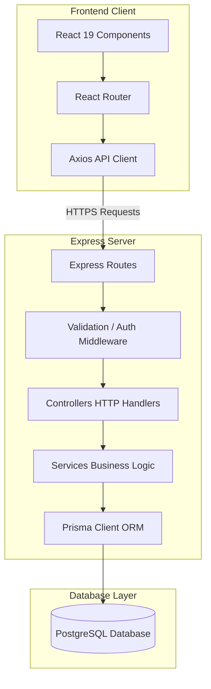

# AVELIS

A premium, full-stack Library Management System with a modern, fluid user experience and a scalable, layered backend architecture.

---

[](#)
[](#)
[](#)
[](#)
[](#)
[](#)
[](#)

---

## Project Overview

AVELIS is a production-quality, premium Library Management System designed to serve as an advanced full-stack portfolio showcase. It demonstrates how a highly interactive, animation-rich frontend interface can be seamlessly integrated with an enterprise-grade backend architecture. 

The application provides readers with a modern, high-fidelity experience for browsing curated collections, cataloging their personal library, logging reading history, and analyzing stats through a polished administration dashboard.

## Motivation / Purpose

Traditional library management systems often suffer from outdated user interfaces, rigid flows, and tightly coupled monolithic backends. AVELIS was built to solve this problem by showing that utility software can feel both premium and exceptionally responsive. 

The primary goals of this project are:
- **Design Excellence**: To demonstrate fluid visual design utilizing dark-themed palettes, custom layouts, and micro-interactions.
- **Architectural Separation**: To implement clean, decoupled design patterns—separating client-side interface controllers from backend transaction management.
- **Maintainability**: To establish a solid codebase foundations using structured layered routing, validation middlewares, and clean relational schemas.

## Project Status

The **AVELIS** project is currently in the active development phase. 
- The **Frontend** interface is fully implemented with high-fidelity, responsive mock views and interactive layout components.
- The **Backend** has been initialized with its structural framework patterns and Prisma schema configurations. Direct PostgreSQL integration, middleware validations, and API routes are currently in active development.

## Implemented Features

### Frontend (Completed)
- **Premium Landing Page**: An immersive entry page highlighting the application's vision with smooth typography.
- **Responsive Navigation**: Clean, adaptive menu layouts tailored for mobile, tablet, and desktop viewports.
- **Hero Section**: A high-impact hero header using modern design styles to introduce the platform.
- **Collections Page**: A curated, interactive layout for discovering various book lists and genres.
- **Library Page**: A dedicated personal library management screen for indexing owned literature.
- **Reading Journal Page**: A beautiful user log designed to review, rate, and record personal reading notes.
- **Dashboard UI**: A comprehensive statistic dashboard visualizing mock user activity metrics.
- **Framer Motion Integration**: Modern micro-interactions, page transitions, and elegant hover animations.
- **Reusable Component Architecture**: Highly modular, isolated React component architecture utilizing the custom AVELIS design system.

### Backend (Implemented So Far)
- **Express Backend Core**: Node.js/Express.js application initialized and integrated with compression, security configurations (Helmet), HTTP logging (Morgan), and CORS middleware.
- **Layered Software Directory**: Organized architecture dividing files into routes, controllers, services, middlewares, and models.
- **Prisma ORM Setup**: Prisma Client configured alongside active database schema declarations.
- **PostgreSQL Configuration**: Outlined datasource details ready for relational database mapping.

## Tech Stack

### Frontend
- **React 19.2.7** — Declarative UI building
- **Vite 8.1.0** — Ultra-fast build tool and bundler
- **JavaScript (ESM)** — Client logic
- **Tailwind CSS v4** — Modern utility-first CSS styling
- **Framer Motion** — Liquid-smooth user interface animations
- **React Router 7.18.0** — Single Page Application routing

### Backend
- **Node.js** — JavaScript runtime environment
- **Express.js 4.21.0** — Lightweight HTTP framework
- **Prisma ORM 6.19.3** — Next-generation database ORM
- **PostgreSQL** — Relational database engine

### Development Tools
- **Git & GitHub** — Version control and hosting
- **VS Code** — Primary code editor
- **Oxlint** — Ultra-fast JavaScript and JSX code linter

---

## Project Architecture

The block diagram below demonstrates the clean flow of data through AVELIS, separating client interactions from database persistence layer:



---

## Folder Structure

```text
AVELIS/
├── public/                 # Static asset folders
├── src/                    # Frontend source root
│   ├── assets/             # Media files, global icons
│   ├── components/         # Reusable UI layout elements
│   ├── context/            # Global React states
│   ├── data/               # Static mock catalog data
│   ├── hooks/              # Custom React utility hooks
│   ├── pages/              # Application views (Landing, Dashboard, etc.)
│   ├── routes/             # Client-side router declarations
│   ├── sections/           # Modular view-specific components
│   ├── types/              # JS / Prop definitions
│   ├── utils/              # Helper utilities
│   ├── App.jsx             # Main application component
│   ├── main.jsx            # Application entry render
│   └── index.css           # Global CSS and Tailwind directives
│
├── server/                 # Backend source root
│   ├── prisma/             # Prisma schema migrations configuration
│   └── src/                # Express backend application
│       ├── config/         # System configurations
│       ├── constants/      # App-wide constants
│       ├── controllers/    # API request handlers
│       ├── docs/           # Documentation and Swagger
│       ├── errors/         # Custom class exceptions
│       ├── helpers/        # General backend helpers
│       ├── lib/            # Shared libraries (Prisma instance)
│       ├── middleware/     # Custom Express interceptors
│       ├── models/         # Database models structure
│       ├── modules/        # Modular domain-driven structures
│       ├── routes/         # API path routing mappings
│       ├── services/       # Core business logic processing
│       ├── types/          # Type declarations
│       ├── uploads/        # Static uploads folder
│       ├── utils/          # Generic system utilities
│       ├── validators/     # Request payload validation rules
│       ├── app.js          # Express app wrapper
│       └── server.js       # Express server initialization entry
│
├── package.json            # Frontend dependency and scripts configuration
└── vite.config.js          # Vite build parameters
```

---

## Getting Started

### Prerequisites
Ensure you have the following installed on your machine:
- **Node.js** (v18.0.0 or higher is recommended)
- **PostgreSQL** database engine

### Installation

1. **Clone the repository:**
   ```bash
   git clone https://github.com/Aaditgupta1234/AVELIS.git
   cd AVELIS
   ```

2. **Install Frontend dependencies:**
   Ensure you are in the root directory:
   ```bash
   npm install
   ```

3. **Install Backend dependencies:**
   Navigate into the `server` directory and install its components:
   ```bash
   cd server
   npm install
   ```

### Running Frontend
From the root directory, start the Vite development server:
```bash
npm run dev
```
The client application will typically launch at `http://localhost:5173`.

### Running Backend
1. Initialize your local configuration file inside the `server/` directory:
   ```bash
   cd server
   cp .env.example .env
   ```
2. Open `.env` and fill out your PostgreSQL database string.
3. Start the Express development backend using Nodemon:
   ```bash
   npm run dev
   ```
   The backend API will run on the configured port, defaulting to `http://localhost:5000/api/v1`.

---

## Environment Variables

Inside the `server/` directory, create a `.env` file based on the template below:

```ini
# Database Connection String
DATABASE_URL=

# App Server Port Configuration
PORT=

# Authentication Secrets
JWT_SECRET=
JWT_REFRESH_SECRET=
```

---

## Current Development Progress

### ✅ Completed
- Premium layout landing page
- Responsive user navigation headers
- Visual assets hero panel
- Library item browse collection view
- Reading Journal log templates
- Interactive Dashboard metrics UI
- Framer Motion micro-interactions
- Reusable modular components structure
- Express API server shell setup
- Prisma ORM definitions and client mappings

### 🚧 In Progress
- PostgreSQL schema setup and active connections
- Backend user authentication routing patterns
- HTTP request validation middleware routines

### ⏳ Planned
- Complete JSON Web Token login authentication flow
- Complete Book database CRUD api endpoints
- User borrowing and book returning history transaction logic
- Role-based user/admin access control configurations
- Production build setups and server deployment

---

## Roadmap

| Module | Completed Features | In Progress Features | Planned Features |
| :--- | :--- | :--- | :--- |
| **Frontend** | Landing Page, Navigation, Hero Panel, Collections, Library page, Reading Journal logs, Dashboard UI | Connecting Login View inputs to authentication APIs | User profile edit dialogs, interactive catalog searches, custom themes |
| **Backend** | Server structure, Express framework configuration, Prisma configuration | PostgreSQL migrations, JWT routes structure, validation middleware | CRUD books logic, checkout/checkin transactions, user access authorization |
| **DevOps** | Project scaffolding, Oxlint linter integration, workspace dependencies | Setup environment template | API deployment pipelines, production server environment setups |

---

## Deployment Status

- **Frontend**: Not deployed yet
- **Backend**: Not deployed yet

*Deployment pipelines will be configured and added after backend API development and authentication systems are fully completed.*

---

## Screenshots


*Figure 1: High-fidelity home page featuring responsive typography and navigation.*


*Figure 2: Curated catalog collections interface allowing users to explore library lists.*


*Figure 3: Personal index where users can manage their private bookshelves.*


*Figure 4: Core user dashboard displaying charts, statistics, and recent book logs.*


*Figure 5: Personal journal for documenting thoughts, page completions, and reviews.*

---

## Contributing

This application is primarily a personal portfolio project. Suggestions, feedback, and issue reporting are highly welcomed. 

If you would like to contribute:
1. Fork the project repository.
2. Create a feature branch (`git checkout -b feature/AmazingFeature`).
3. Commit your modifications (`git commit -m 'Add some AmazingFeature'`).
4. Push to the branch (`git push origin feature/AmazingFeature`).
5. Open a Pull Request for review.

---

## License

This project is licensed under the **ISC License** — see the `server/package.json` file details.

---

## Author

**Aadit Gupta**
- GitHub: [@Aaditgupta1234](https://github.com/Aaditgupta1234)
