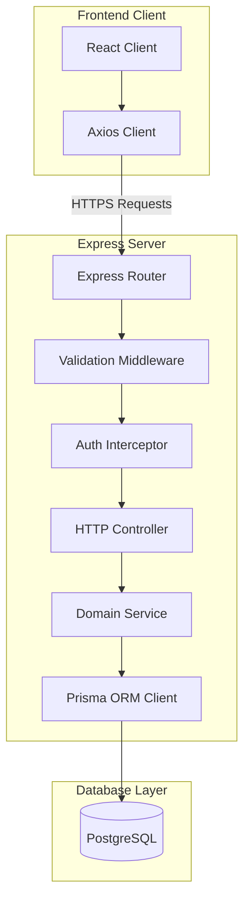
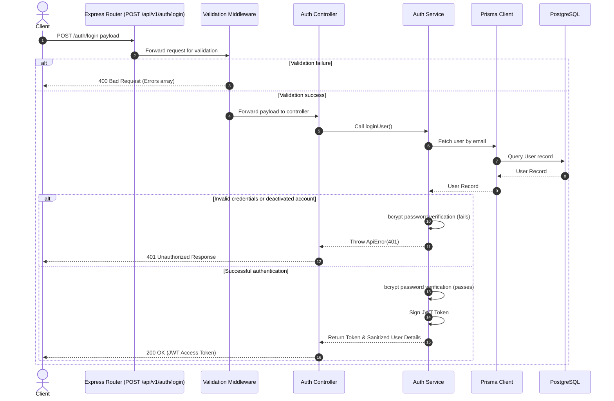

# Software Architecture Guide

AVELIS is engineered with an enterprise-grade, layered software architecture that separates user interaction layers from core business transactions and data persistence.

---

## Architectural Principles

1. **Separation of Concerns:** Each layer handles a singular responsibility (routing, payload validation, authorization, business rules, or persistence).
2. **Thin Controllers:** Controllers only parsing HTTP requests, extract parameters, trigger service operations, and compile HTTP response envelopes. They contain no database or validation logic.
3. **Service-Driven Business Logic:** Services are the single source of truth for business rules, executing transactions, managing queues, and interacting with the ORM.
4. **Data Access Isolation:** Direct access to PostgreSQL tables is barred. The Prisma Client acts as the absolute interface layer.
5. **Stateless Sessions:** User sessions are fully stateless. Auth details are encoded inside signed JWT tokens parsed by middleware.
6. **Robust Error Propagation:** Exceptions are routed up to a centralized error interceptor that converts operational errors into clean API error payloads.

---

## System Flow Architecture

The system segregates frontend React assets from the Express API engine, communicating over secure HTTPS requests:

---

## Authentication Lifecycle Sequence

The request-response lifecycle for authenticated login verification:

---

## Layered Directory Layout

Backend logic is organized into distinct logical layers under `server/src/`:

| Layer | Directory | Responsibility |
| :--- | :--- | :--- |
| **Routes** | `src/routes/` & `src/modules/` | Maps URLs to specific controller entry points. |
| **Validators** | `src/validators/` & `src/validations/` | Sanitizes payload shapes before controllers execute. |
| **Middleware** | `src/middleware/` | Handles JWT validation, RBAC guards, and global errors. |
| **Controllers** | `src/controllers/` | Extracts HTTP inputs and maps responses. |
| **Services** | `src/services/` | Contains core transactional domain logic. |
| **Library Clients** | `src/lib/` | Instantiates shared singletons (e.g. Prisma instance). |
| **Utilities** | `src/utils/` & `src/helpers/` | Exposes pure validation helpers and shared class exceptions. |
