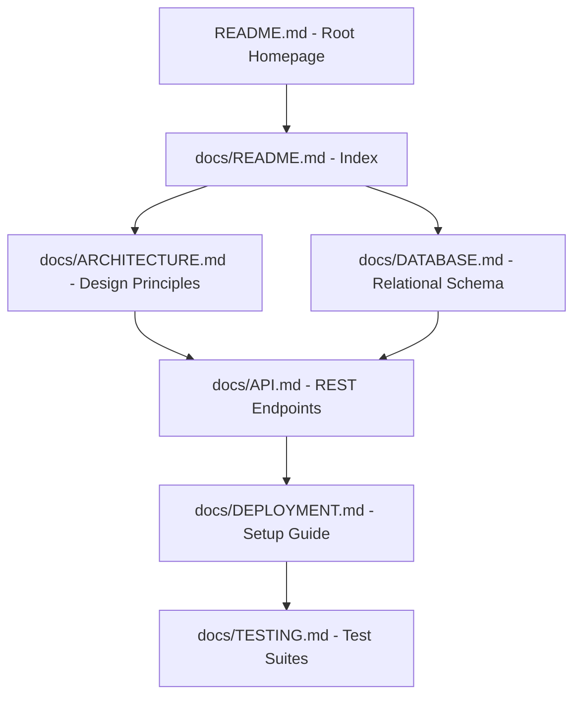

# AVELIS Documentation Index

Welcome to the technical documentation for AVELIS, a premium, production-quality Library Management System. This directory contains detailed specifications, architecture reports, and developer guides to help you understand, run, and extend the system.

---

## Documentation Registry

| Document | Purpose | Target Audience |
| :--- | :--- | :--- |
| **[API Reference](API.md)** | Complete table-based REST API endpoint specifications. | Frontend Integrators, API Clients |
| **[Architecture Guide](ARCHITECTURE.md)** | High-level system blocks, design principles, and sequence flows. | System Architects, Backend Developers |
| **[Database Overview](DATABASE.md)** | Entity Relationship details, schema tables, junction designs, and constraints. | Database Administrators, Developers |
| **[Performance Report](PERFORMANCE.md)** | Detailed summary of Phase 13.5 optimization milestones and benchmark results. | DevOps, Performance Engineers |
| **[Testing & Verification](TESTING.md)** | Overview of automated suites, coverage matrices, and manual run guides. | QA Engineers, Contributors |
| **[Security Architecture](SECURITY.md)** | Authentication structures, RBAC permissions, and infrastructure hardening. | Security Auditors, DevOps |
| **[Deployment Guide](DEPLOYMENT.md)** | Step-by-step setup, configuration parameters, and production startup. | DevOps, System Operators |
| **[Contributing Workflow](CONTRIBUTING.md)** | Branching, code style conventions, and PR submission pipelines. | Open Source Contributors |
| **[Changelog](CHANGELOG.md)** | Semantic milestone-by-milestone history of features and fixes. | All Stakeholders |
| **[Architecture Decision Records](adr/)** | Directory of historical design rationale documents (ADRs). | Tech Leads, Architecture Reviewers |

---

## Recommended Reading Order

1. **For Evaluators & Visitors:** Start with the root `README.md` to grasp the project snapshot, goals, and limitations.
2. **For Frontend Integrators:** Read `docs/API.md` and `docs/ARCHITECTURE.md` to align on API structures, error wrappers, and data sequences.
3. **For Backend Developers:** Read `docs/DATABASE.md`, `docs/ARCHITECTURE.md`, and review the **[ADRs](adr/)** to comprehend schema designs and design patterns.
4. **For DevOps & System Operators:** Follow `docs/DEPLOYMENT.md`, `docs/PERFORMANCE.md`, and `docs/SECURITY.md` for performance scaling, parameters, and deployment commands.

---

## Document Version & Currency

* **Documentation Version:** `v1.0.0-backend`
* **Prisma Schema Reference:** Prisma Schema 6.x
* **Express Framework Reference:** Express 4.x
* **Status:** Current through **Phase 13.7 (Documentation & Cleanup)**. All documentation is synchronized and security verified.
