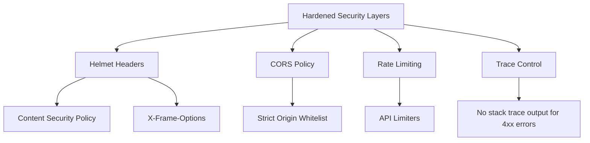

# Security Architecture Specification

This document details the authentication models, access rules, data isolation parameters, and security hardening guidelines implemented in the AVELIS server application.

---

## Authentication & Authorization Model

AVELIS employs stateless, token-based authorization built on JSON Web Tokens (JWT) and Role-Based Access Control (RBAC):

* **Identity Verification:** Encrypted user passwords are verified using bcrypt securely without exposing plaintext credentials.
* **Token Issuer:** Authenticated sessions receive a signed JWT access token containing standard identity claims (`id`, `email`, `role`).
* **Protected Interceptors:** Token validations are handled by centralized interceptor middleware (`authMiddleware`) that decodes payloads, validates status flags, and attaches authenticated profiles to request contexts.

---

## Access Policy Matrix (RBAC)

AVELIS enforces two access roles: `MEMBER` and `ADMIN`:

| Feature Domain | Member Access | Admin Access | Authentication Type |
| :--- | :--- | :--- | :--- |
| **Catalog Browsing** | Read-Only | Read-Only | None (Public) |
| **Reviews & Ratings**| Read / Write | Moderation / Delete | JWT Authorized |
| **Lending Checkout** | Read / Write | Read / Write / Return | JWT Authorized |
| **Reservations Hold**| Read / Write | Full Manage Queue | JWT Authorized |
| **User Registries**  | Blocked | Read / Write | Admin Guarded |
| **Book Management**  | Blocked | Create / Update / Delete | Admin Guarded |

---

## Hardened Configurations

1. **Helmet HTTP Headers:** Integrated Helmet middleware to set security headers, mitigating Cross-Site Scripting (XSS), clickjacking, and mime-type sniffing attacks. Configures:
   - `Content-Security-Policy`: Strict directives restricting resources to `'self'`, blocking object embedding, framing, and base/form overrides.
   - `Permissions-Policy`: Restricts browser feature permissions (camera, microphone, geolocation, etc.) using custom headers.
   - `Strict-Transport-Security` (HSTS): Enabled in production to enforce HTTPS connections.
   - `Referrer-Policy`, `X-Content-Type-Options`, `X-Frame-Options`, `X-DNS-Prefetch-Control`, `Origin-Agent-Cluster`, and `X-Permitted-Cross-Domain-Policies` set to secure defaults.
2. **Cross-Origin Resource Sharing (CORS):** Restricted to white-listed client origins, parsed dynamically from environment variables (`CORS_ORIGIN`). Preflight requests are cached in browsers for up to `CORS_MAX_AGE` (default `86400` seconds) to optimize performance.
3. **HTTP Hardening**:
   - Framework exposure header `X-Powered-By` is explicitly disabled at the server level.
   - Dynamic caching is disabled on all sensitive routes (e.g. `/auth`, `/users`, `/admin`, `/loans`, `/reservations`) using standard cache-busting headers (`Cache-Control: no-store, no-cache`, `Pragma: no-cache`, `Expires: 0`).
4. **Cookie Security Guidelines (Future-Proofing)**:
   - While AVELIS currently uses header-based JWT tokens (`Authorization: Bearer`), any future cookie usage must strictly enforce:
     - `HttpOnly`: true (mitigates session theft via XSS).
     - `Secure`: true (enforces TLS transmission).
     - `SameSite`: `'Strict'` or `'Lax'` (mitigates CSRF vulnerabilities).
5. **Rate Limiting & Slowdown**: Protects endpoints from brute-force attacks and resource exhaustion using progressive throttling.
6. **Conditional Trace Suppression:** Suppresses detailed error stack trace outputs in production mode for non-server client errors (errors `< 500`), avoiding stack disclosure.

---

## Vulnerability Reports

To report security vulnerabilities, please do not open public GitHub issues. Instead, contact the maintainers directly at their development email.
