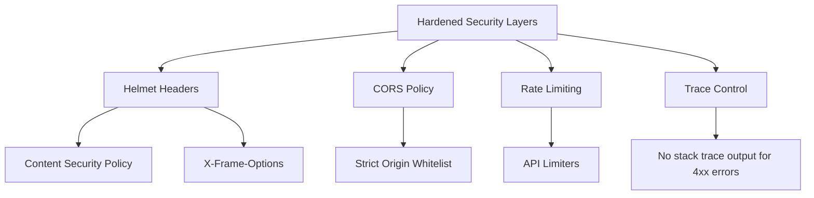

# Security Architecture Specification

This document details the authentication models, access rules, data isolation parameters, and security hardening guidelines implemented in the AVELIS server application.

---

## Authentication & Authorization Model

AVELIS employs stateless, token-based authorization built on JSON Web Tokens (JWT) and Role-Based Access Control (RBAC):

* **Identity Verification:** Encrypted user passwords are verified using bcrypt securely without exposing plaintext credentials.
* **Token Issuer:** Authenticated sessions receive a signed JWT access token containing standard identity claims (`id`, `email`, `role`).
* **Protected Interceptors:** Token validations are handled by centralized interceptor middleware (`authMiddleware`) that decodes payloads, validates status flags, and attaches authenticated profiles to request contexts.

---

## Access Policy Matrix (RBAC)

AVELIS enforces two access roles: `MEMBER` and `ADMIN`:

| Feature Domain | Member Access | Admin Access | Authentication Type |
| :--- | :--- | :--- | :--- |
| **Catalog Browsing** | Read-Only | Read-Only | None (Public) |
| **Reviews & Ratings**| Read / Write | Moderation / Delete | JWT Authorized |
| **Lending Checkout** | Read / Write | Read / Write / Return | JWT Authorized |
| **Reservations Hold**| Read / Write | Full Manage Queue | JWT Authorized |
| **User Registries**  | Blocked | Read / Write | Admin Guarded |
| **Book Management**  | Blocked | Create / Update / Delete | Admin Guarded |

---

## Hardened Configurations



1. **Helmet HTTP Headers:** Integrated Helmet middleware to set security headers, mitigating Cross-Site Scripting (XSS), clickjacking, and mime-type sniffing attacks. Configures:
   - `Content-Security-Policy`: Strict directives restricting resources to `'self'`, blocking object embedding, framing, and base/form overrides.
   - `Permissions-Policy`: Restricts browser feature permissions (camera, microphone, geolocation, etc.) using custom headers.
   - `Strict-Transport-Security` (HSTS): Enabled in production to enforce HTTPS connections.
   - `Referrer-Policy`, `X-Content-Type-Options`, `X-Frame-Options`, `X-DNS-Prefetch-Control`, `Origin-Agent-Cluster`, and `X-Permitted-Cross-Domain-Policies` set to secure defaults.
2. **Cross-Origin Resource Sharing (CORS):** Restricted to white-listed client origins, parsed dynamically from environment variables (`CORS_ORIGIN`). Preflight requests are cached in browsers for up to `CORS_MAX_AGE` (default `86400` seconds) to optimize performance.
3. **HTTP Hardening**:
   - Framework exposure header `X-Powered-By` is explicitly disabled at the server level.
   - Dynamic caching is disabled on all sensitive routes (e.g. `/auth`, `/users`, `/admin`, `/loans`, `/reservations`) using standard cache-busting headers (`Cache-Control: no-store, no-cache`, `Pragma: no-cache`, `Expires: 0`).
4. **Cookie Security Guidelines (Future-Proofing)**:
   - While AVELIS currently uses header-based JWT tokens (`Authorization: Bearer`), any future cookie usage must strictly enforce:
     - `HttpOnly`: true (mitigates session theft via XSS).
     - `Secure`: true (enforces TLS transmission).
     - `SameSite`: `'Strict'` or `'Lax'` (mitigates CSRF vulnerabilities).
5. **Rate Limiting & Slowdown**: Protects endpoints from brute-force attacks and resource exhaustion using progressive throttling.
6. **Conditional Trace Suppression:** Suppresses detailed error stack trace outputs in production mode for non-server client errors (errors `< 500`), avoiding stack disclosure.
7. **Centralized Security Logging & Auditing**: Security-critical events are captured as structured JSON records, detailing request route, method, IP, user identifier, and message context:
   - **Audited Events**: Authentication success/failure, authorization failure, token validation failure (expired, malformed, or signature errors), payload validation errors, rate-limiting, request slowdown throttling, 404 scanning targets (suspicious route scans), and critical security exceptions.
   - **Log Schema**:
     ```json
     {
       "timestamp": "ISO8601 String",
       "eventType": "string",
       "severity": "INFO | WARN | ERROR | CRITICAL",
       "route": "string",
       "method": "string",
       "clientIp": "string",
       "userId": "string | null",
       "requestId": "string | null",
       "message": "string",
       "metadata": {}
     }
     ```
   - **Automatic Sensitive Data Redaction**: Undergoes recursive sanitization to scrub confidential properties (e.g., `password`, `passwordConfirm`, `token`, `refreshToken`, `Authorization`, `cookie`, `apiKey`, `secret`, `otp`, `databaseUrl`, `jwtSecret`) replacing them with `[REDACTED]` prior to logging.

---

## Security Verification Matrix

AVELIS undergoes automated penetration testing and validation to confirm that all security controls behave correctly under simulated attacks.

| Security Layer | Tested Attack Scenario | Observable Outcomes | Test Result |
| :--- | :--- | :--- | :--- |
| **Authentication** | Missing token, expired token, signature tampering, malformed JWT headers, Basic scheme injection | Returns generic `401 Unauthorized` client response; prints `JWT_FAILURE` log; does not leak stack traces | **PASS** |
| **Authorization** | Member accessing admin controls (`/admin/loans`); privilege escalation attempts | Returns generic `403 Forbidden` client response; prints `AUTHZ_FAILURE` log; access is strictly blocked | **PASS** |
| **Input Validation** | Malformed JSON payloads; invalid UUID strings on parameters | Rejected with `400 Bad Request` before controller execution; prints `VALIDATION_FAILURE` log | **PASS** |
| **Injection Protection** | SQL injection strings (`' OR '1'='1`); Cross-Site Scripting scripts (`<script>`) | Processed safely or rejected; server remains fully stable; no database errors or scripts are executed | **PASS** |
| **Payload Size Limits** | JSON payloads exceeding configured sizes (e.g., > `MAX_JSON_SIZE`) | Rejected with `413 Payload Too Large`; server does not crash | **PASS** |
| **Abuse Protection** | Client request bursts exceeding thresholds | Throttled with progressive delays; blocked with `429 Too Many Requests`; prints `RATE_LIMIT_EXCEEDED` log | **PASS** |
| **HTTP Hardening** | Header scanning; sensitive caching probes; preflight OPTIONS audits | All Helmet/Permissions headers present; `X-Powered-By`/`X-XSS-Protection` absent; sensitive routes set `no-store` caching | **PASS** |
| **Graceful Recovery** | Benign request execution (`GET /books`) after simulated attacks | The server is verified stable and fully operational; returns `200 OK` with valid data | **PASS** |
| **Process Termination**| SIGTERM signal dispatch to the running application | Terminates cleanly; releases resources within 3 seconds; zero uncaught exit exceptions | **PASS** |

### Verification Assumptions & Limitations
- **Trust Proxy Resolution**: Tests assume trust proxy hop settings are configured correctly to prevent IP spoofing in multi-proxy production environments.
- **Client-Side Storage**: The backend enforces strict `no-store` headers for sensitive data, but client applications must still follow local storage best practices.

---

## Vulnerability Reports

To report security vulnerabilities, please do not open public GitHub issues. Instead, contact the maintainers directly at their development email.
