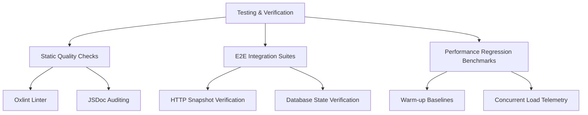

# Testing & Verification Guide

AVELIS employs a multi-tiered testing and verification strategy to ensure logical correctness, API stability, performance scaling, and database consistency.

---

## Testing Hierarchy

Verification is structured into three primary categories:



1. **Static Quality Checks:** Linting, JSDoc verification, and code structure auditing.
2. **E2E Integration Suites:** Verifying request lifecycles, auth protections, schema validation, and database updates.
3. **Performance Regression Benchmarks:** Measuring latency, throughput, and heap usage under concurrent load compared to baselines.

---

## Verification Scripts

Each major backend implementation milestone includes a dedicated verification script located in `server/scratch/`. These scripts spin up isolated test servers, seed data, run automated tests, and tear down test states.

### Milestone Verification Matrix

| Script | Phase | Scope |
| :--- | :--- | :--- |
| **[verify_phase_13.5.3.js](../server/scratch/verify_phase_13.5.3.js)** | 13.5.3 | Database connections, transaction timeout limits, and singleton client patterns. |
| **[verify_phase_13.5.4.js](../server/scratch/verify_phase_13.5.4.js)** | 13.5.4 | JWT parsing speed, validation hoisting, stack trace limits, and concurrent load tests. |
| **[verify_phase_13.6.5.4.js](../server/scratch/verify_phase_13.6.5.4.js)** | 13.6.5 | Rate limiting limits, progressive request delay calculations, and trust proxy hop counts. |
| **[verify_phase_13.6.6.js](../server/scratch/verify_phase_13.6.6.js)** | 13.6.6 | Helmet HTTP headers verification, selective cache control headers, and CORS preflight optimization. |
| **[verify_phase_13.6.7.js](../server/scratch/verify_phase_13.6.7.js)** | 13.6.7 | Centralized security auditing logs schema, recursive credential redaction, and error logging checks. |
| **[verify_phase_13.6.8.js](../server/scratch/verify_phase_13.6.8.js)** | 13.6.8 | Comprehensive penetration testing suite, simulating JWT bypass, SQLi, XSS, rate violations, recovery, and SIGTERM clean shutdown. |
| **[verify_phase_13.7.js](../server/scratch/verify_phase_13.7.js)** | 13.7.0 | Quality assurance, obsolete folder deletions check, JSDoc comment check, markdown link validation, and H1 heading uniqueness check. |

---

## How to Run Verification

### Prerequisites
* PostgreSQL database configured and running.
* Environment variables loaded (specifically `DATABASE_URL` and `JWT_SECRET`).

### Executing Phase Verification
To run the latest Request Processing & Middleware Optimization verification suite:

```bash
# Navigate to backend directory
cd server

# Run the target verification script
node scratch/verify_phase_13.5.4.js
```

### Expected Output
The script prints detailed step results followed by a summary status matrix:

```text
================================================================
  Phase 13.5.4 — Verification Summary
================================================================

  Check                          Result
  ------------------------------ ------
  Logging Audit                  PASS
  Middleware Ordering            PASS
  Authentication                 PASS
  Validation Parity              PASS
  Stack Trace Optimization       PASS
  Throughput Benchmark           PASS
  Query Count                    PASS
  Response Snapshot              PASS
  ------------------------------ ------
  Overall                        PASS

  Passed: 56/56 assertions
================================================================
```
