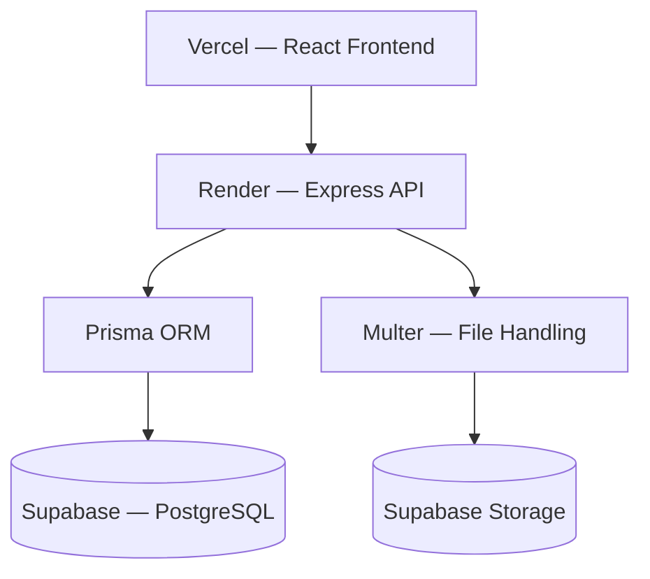

# AVELIS Server

> Production-grade backend for the AVELIS Library Management System.

## Technology Stack

| Technology | Purpose |
|------------|---------|
| Node.js | Runtime |
| Express.js | HTTP framework |
| PostgreSQL | Database |
| Prisma | ORM |
| dotenv | Environment configuration |
| cors | Cross-origin resource sharing |
| helmet | Security headers |
| compression | Response compression |
| morgan | HTTP request logging |
| express-rate-limit | Rate limiting |

## Folder Structure

```text
server/
│
├── src/
│   ├── config/            # App configuration (env, logger)
│   ├── controllers/       # Route handlers (feature-organized)
│   ├── services/          # Business logic layer
│   ├── routes/            # API route definitions
│   ├── validations/       # Request validation middleware
│   ├── middleware/        # Express middleware
│   │   ├── security/      # Auth, authorization, rate limiting
│   │   ├── error/         # Error & 404 handling
│   │   └── auth.middleware.js
│   ├── helpers/           # Shared helper functions (resource.helper.js)
│   ├── shared/
│   │   └── selects/       # Reusable Prisma query select definitions
│   ├── utils/             # Shared utilities (response helpers, error classes)
│   ├── constants/         # Application constants
│   ├── modules/           # Self-contained feature modules (review)
│   ├── lib/               # Prisma client singleton
│   ├── app.js             # Express app configuration
│   └── server.js          # Server entry point
│
├── prisma/
│   └── schema.prisma      # Prisma data model
├── scratch/               # Manual regression & concurrency test scripts
├── package.json
├── .env.example
├── .gitignore
└── README.md
```

## Getting Started

### Prerequisites

- Node.js >= 18
- PostgreSQL (local or hosted)

### Installation

```bash
# Navigate to the server directory
cd server

# Install dependencies
npm install

# Copy environment template
cp .env.example .env

# Edit .env with your configuration
```

### Running the Server

```bash
# Development (with hot-reload)
npm run dev

# Production
npm start
```

### Database Migrations

```bash
# Production / staging — apply existing migrations
npx prisma migrate deploy

# Regenerate Prisma Client after schema changes
npx prisma generate

# Development only — push schema without generating a migration
npx prisma db push
```

## Available Scripts

| Script | Command | Description |
|--------|---------|-------------|
| `dev` | `nodemon src/server.js` | Start with hot-reload |
| `start` | `node src/server.js` | Start in production mode |

## API Base URL

```
http://localhost:5000/api/v1
```

---

## Architecture Overview

### Centralized Configuration (`src/config/env.js`)

All environment-derived values are loaded and validated at startup via `config/env.js`.
Business constants (borrow duration, reservation window, pagination limits, etc.) are
resolved from environment variables with safe defaults.

| Key | Env Var | Default |
|-----|---------|---------|
| `loanDurationDays` | `LOAN_DURATION_DAYS` | 14 |
| `renewalLimit` | `RENEWAL_LIMIT` | 2 |
| `maxActiveReservations` | `MAX_ACTIVE_RESERVATIONS` | 3 |
| `reservationPickupWindowHours` | `RESERVATION_PICKUP_WINDOW_HOURS` | 48 |
| `defaultPageSize` | `DEFAULT_PAGE_SIZE` | 10 |
| `maxPageSize` | `MAX_PAGE_SIZE` | 100 |
| `bcryptSaltRounds` | `BCRYPT_SALT_ROUNDS` | 10 |

### Shared Prisma Select Definitions (`src/shared/selects/`)

Reusable Prisma `select` / `include` objects are centralized in dedicated files so every
service layer query returns a consistent shape without duplicating field lists.

| File | Exports |
|------|---------|
| `book.select.js` | `BOOK_SELECT`, `BOOK_PUBLIC_INCLUDE` |
| `user.select.js` | `USER_SELECT` |
| `loan.select.js` | `LOAN_SELECT` |
| `reservation.select.js` | `RESERVATION_SELECT`, `RESERVATION_SELECT_WITH_OWNER` |
| `review.select.js` | `REVIEW_SELECT` |

### Shared Resource Helpers (`src/helpers/resource.helper.js`)

Lookup helpers that retrieve an entity or throw a `404 ApiError` are consolidated in
`resource.helper.js`:

```js
getUserOrThrow(userId, tx?)
getBookOrThrow(bookId, tx?)
getCopyOrThrow(copyId, tx?)
```

Each helper accepts an optional Prisma transaction client (`tx`) so it can be called both
inside and outside transaction blocks.

### Optimistic Concurrency Control (OCC)

Critical multi-step workflows use status-guarded `updateMany()` operations inside
`prisma.$transaction(...)` blocks to prevent race conditions across parallel server instances.

| Workflow | OCC Guard |
|----------|-----------|
| `borrowBook` | Copy status must be `AVAILABLE` |
| `returnBook` | Loan status must be `ACTIVE` |
| `createReservation` | Copy status must be `AVAILABLE` (falls back to PENDING queue) |
| `cancelReservation` | Reservation must be in `PENDING` or `READY_FOR_PICKUP` |
| `fulfillNextReservationForBook` | Copy and reservation status both guarded |
| `processExpiredReservations` | Reservation and copy status both guarded |

If `updateMany` returns `count === 0`, the transaction is aborted to preserve consistency.

### Rate Limiting (`src/middleware/security/rateLimiter.js`)

| Limiter | Window | Max Requests | Applied To |
|---------|--------|--------------|------------|
| `authLimiter` | 15 min | 20 | `/api/v1/auth` |
| `apiLimiter` | 15 min | 150 | `/api` (all routes) |

Both limiters use `express-rate-limit` with `standardHeaders: true` and are compatible with
future distributed stores (e.g., Redis via `rate-limit-redis`).

### Structured Logging

Request logs are handled by `morgan` routed through the internal `logger` from
`config/logger.js`. In production, `combined` format is used. In development, `dev` format
is used.

Audit events are logged at controller level for the following operations:

- `[AUTH]` — registration, login (success and failure)
- `[LOAN]` — borrow, return (success and failure)
- `[RESERVATION]` — create, cancel (success and failure)

**Logging rules** — the following are never written to logs:

- Passwords or password hashes
- JWTs or refresh tokens
- `Authorization` headers
- Personally identifiable information (PII)
- Secrets or environment variable values

---

### Loan Module (Phase 12.1 Initialization)

The Loan module is implemented using the flat architecture pattern (controllers, services, validations, routes). Phase 12.1 initialized the module for subsequent development by introducing 3 new placeholder endpoints and correcting middleware ordering.

#### API Endpoints (Phase 12.1 Target)

| Method | Endpoint | Authorization | Description | Status (Phase 12.1) |
|---|---|---|---|---|
| `POST` | `/api/v1/loans` | Admin | Create a new loan transaction (Borrow) | Exists (unchanged) |
| `GET` | `/api/v1/loans/:id` | Member (Owner) / Admin | Retrieve details of a specific loan | Exists (unchanged) |
| `GET` | `/api/v1/loans/me` | Member | Retrieve the current user's active loans | Placeholder (501) |
| `GET` | `/api/v1/loans/history` | Member | Retrieve the current user's loan history | Placeholder (501) |
| `PATCH` | `/api/v1/loans/:id/return` | Admin | Complete an active loan (Return copy) | Exists (unchanged) |
| `PATCH` | `/api/v1/loans/:id/renew` | Member | Renew an active loan | Placeholder (501) |
| `GET` | `/api/v1/admin/loans` | Admin | Retrieve paginated loans catalog | Exists (alias) |

---

## 🐳 Docker Support

> **Production architecture remains unchanged.**
> Docker support is purely additive and has zero effect on the existing Render and Supabase deployments.
>
> | Layer | Service |
> |-------|---------|
> | Frontend | React → **Vercel** |
> | Backend | Express → **Render** |
> | Database | PostgreSQL → **Supabase** |
> | Storage | Files → **Supabase Storage** |

### Architecture



### Docker Files

```
server/
├── Dockerfile
├── .dockerignore
└── docker-compose.yml
```

### Prerequisites

- [Docker](https://docs.docker.com/get-docker/) installed
- [Docker Compose](https://docs.docker.com/compose/) installed (included with Docker Desktop)

---

### Build Image

```bash
# Run from the server/ directory
docker build -t avelis-api .
```

Build verified successfully. Prisma Client is generated inside the image during `docker build`.

---

### Run Container

```bash
docker run \
  --env-file .env \
  -p 5000:5000 \
  avelis-api
```

Uses your existing `server/.env` for all configuration. Connects to Supabase PostgreSQL and Supabase Storage directly — no local database required.

#### Required Environment Variables

All values in `.env` must be **unquoted** (see [Troubleshooting](#troubleshooting) below).

| Variable | Description |
|----------|-------------|
| `DATABASE_URL` | Supabase pooled connection string (pgBouncer) |
| `DIRECT_URL` | Supabase direct connection string (migrations) |
| `JWT_SECRET` | JWT signing secret — minimum 32 characters |
| `JWT_EXPIRES_IN` | Token expiry — e.g. `7d` |
| `CLIENT_URL` | Frontend origin for CORS |
| `SUPABASE_URL` | Supabase project URL |
| `SUPABASE_SECRET_KEY` | Supabase service role key |
| `PORT` | Optional — defaults to `5000` |

---

### Health Check

```bash
curl http://localhost:5000/api/v1/health
```

Expected response:

```json
{
  "success": true,
  "data": {
    "status": "healthy",
    "database": "connected"
  }
}
```

The container also includes a Docker `HEALTHCHECK` that automatically probes this endpoint every 30 seconds. The container reports `healthy` or `unhealthy` in `docker ps` output.

Additional probes:

| Endpoint | Purpose |
|----------|---------|
| `GET /api/v1/health` | Full health check with live DB ping |
| `GET /api/v1/ready` | Readiness probe |
| `GET /api/v1/live` | Liveness probe — no DB call |

---

### Docker Compose — Local Development Only

> ⚠️ **Local development only.** Docker Compose runs a local `postgres:16-alpine` service.
> This is NOT a replacement for Supabase. File uploads always require real Supabase credentials.
> Production continues to use Render + Supabase.

```bash
# Start all services (backend + local postgres)
docker compose up --build

# Stop all services
docker compose down

# Stop and remove volumes (deletes local DB data)
docker compose down -v
```

API available at `http://localhost:5000/api/v1`

---

### Logs & Container Management

```bash
# View logs
docker logs avelis-api

# Follow logs
docker logs -f avelis-api

# Stop container
docker stop avelis-api

# Remove container
docker rm avelis-api
```

---

### Verification Results

The following checks were completed against a running container connected to the live Supabase instance.

| Component | Status |
|-----------|--------|
| Docker Build | ✅ |
| Prisma Client Generate | ✅ |
| Supabase Database Connection | ✅ |
| Supabase Storage Connection | ✅ |
| Storage Buckets (`book-covers`, `book-pdfs`) | ✅ |
| Server Startup on Port 5000 | ✅ |
| `GET /api/v1/health` → HTTP 200 | ✅ |
| Docker `HEALTHCHECK` | ✅ |
| Graceful SIGTERM Shutdown | ✅ |

**Verified startup output:**

```
[INFO ] Database connection established successfully
[INFO ] [StorageService] Supabase Storage initialization & read-only bucket
         verification succeeded. { buckets: [ 'book-covers', 'book-pdfs' ] }
[INFO ] ================================================
[INFO ]   AVELIS Server
[INFO ]   Environment : development
[INFO ]   Port        : 5000
[INFO ] ================================================
[INFO ] GET /api/v1/health 200 452.770 ms - 216
[INFO ] SIGTERM received. Starting graceful shutdown...
[INFO ] HTTP server closed
[INFO ] Database connection gracefully closed
[INFO ] Graceful shutdown complete
```

---

### Notes

- Base image: `node:22-alpine`
- `prisma` CLI is a `devDependency` — `npm ci` installs it so `npx prisma generate` can run during `docker build`
- After Prisma Client generation, `npm prune --omit=dev` removes all devDependencies to keep the image lean. `@prisma/client` (a production dependency) is preserved
- `data/` directory is included in the image — required at runtime by `bundle.service.js` and `hero.service.js`
- No application code, routes, middleware, Prisma schema, or deployment configuration was modified

---

### Troubleshooting

#### Invalid supabaseUrl on container startup

**Symptom:**
```
Error: Invalid supabaseUrl: Must be a valid HTTP or HTTPS URL.
```

**Cause:** Docker `--env-file` does **not** strip surrounding quotes from values. `dotenv` (used locally) does strip them — so the same `.env` file that works locally will crash the container if values are quoted.

```bash
# ❌ Wrong — quotes are injected literally into the container
SUPABASE_URL="https://xyz.supabase.co"

# ✅ Correct — unquoted values work with both dotenv and Docker
SUPABASE_URL=https://xyz.supabase.co
```

**Fix:** Remove all surrounding quotes from every value in `server/.env`.

---

### Rollback

Docker support is additive only. To remove it entirely:

```bash
git revert HEAD
```

No application code was changed. Render and Supabase are unaffected.

---


## Deployment Checklist


Before deploying to production:

- [ ] All automated tests pass
- [ ] Prisma migrations apply successfully: `npx prisma migrate deploy`
- [ ] Prisma Client is regenerated: `npx prisma generate`
- [ ] Application starts without errors
- [ ] No unused imports or dead code remain
- [ ] All concurrency scenarios verified via `server/scratch/verify_concurrency.js`
- [ ] Transaction rollback tests pass
- [ ] No ESLint warnings remain (if ESLint is configured)
- [ ] Existing API contracts remain backward compatible
- [ ] README and deployment documentation are up to date

---

## Troubleshooting

### Missing environment variables

If the server refuses to start with `Missing required environment variables`, copy
`.env.example` to `.env` and fill in all required values. The full list of required keys
is defined in `src/config/env.js` under `REQUIRED_VARS`.

### JWT_SECRET too short

`JWT_SECRET` must be at least 32 characters. Generate a secure value:

```bash
node -e "console.log(require('crypto').randomBytes(32).toString('hex'))"
```

### Prisma migration errors

If `prisma migrate deploy` reports drift between the schema and migration history, do not
run `prisma migrate reset` in production. Instead:

1. Review the drift using `npx prisma migrate status`
2. Apply the missing migration manually if safe
3. Contact the team before any destructive schema operation

## License

ISC
